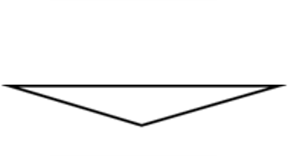

## Balkar vid brand

### Utan vippning

För balkar i tvärsnittsklass 1 och 2 gäller att momentkapaciteten beräknas med antagande om plasticitet enligt

$$
M_{Rd,fi} = k_{y,T}f_yW_{pl}
$$

För tvärsnittsklass 3 gäller istället att momentkapaciteten beräknas med antagande om elasticitet enligt

$$
M_{Rd,fi} = k_{y,T}f_yW_{el}
$$

Den kritiska temperaturen uppstår då

$$
M_{Ed,fi} = M_{Rd_fi}
$$

Det går sedan att beräkna balkens kritiska temperatur utifrån 

### Med vippning

Vippning kan betraktas på samma sätt som en balk där den tryckta flänsen fungerar som en pelare. Vid beräkning av bärförmågan måste därför reduktionsfaktorn $\chi_{fi,LT}$ beaktas för att ta hänsyn till instabilitetsfenomen. Valet mellan plastiskt och elastiskt tvärsnittsmodulvärde, $W_{pl}$ respektive $W_{el}$, beror på tvärsnittsklassen.

$$
M_{Rd,fi}=\chi_{fi,LT} k_{y,T} f_y W_{el/pl}
$$

där $\chi_{fi,LT}$ beräknas enligt

$$
\chi_{fi,LT}=\frac{1}{\phi_{LT}+\sqrt{\phi_{LT}^2-\bar{\lambda}_{fi,LT}^2}}
$$

där

$$
\phi_{LT}=\frac{1}{2}\left(1+\alpha \bar{\lambda}_{fi,LT}+\bar{\lambda}_{fi,LT}^2\right)
$$

och

$$
\alpha=0,65\sqrt{\frac{235}{f_y}}
$$

Utöver det ska slankheten, $\bar{\lambda}_{fi,LT}$, beräknas beroende på slankheten i kallt tillstånd, $\bar{\lambda}_{LT}$, samt $k_{y,T}$ och $k_{E,T}$ vid förhöjd temperatur enligt

$$
\bar{\lambda}_{fi,LT}=\bar{\lambda}_{LT}\sqrt{\frac{k_{y,T}}{k_{E,T}}}
$$

där slankheten i kallt tillstånd, $\bar{\lambda}_{LT}$, beräknas som

$$
\bar{\lambda}_{LT}=\sqrt{\frac{f_y W_{el/pl}}{M_{cr}}}
$$

Antagande om elasticitet eller plasticitet beror på tvärsnittsklass. kritiska momentet $M_{cr}$ beräknas enligt

$$
M_{cr}=C_1 \pi^2 \frac{E I_z}{\left(k_z L\right)^2}
\sqrt{\left(\frac{k_z}{k_w}\right)^2 \frac{I_w}{I_z}+
\frac{\left(k_z L\right)^2 G I_t}{\pi^2 E I_z}+
\left(C_2 z_g \right)^2}-
C_2 z_g
$$

För en balk som är statiskt sammanhållen med det bjälklag som den bär kan lasten normalt antas vara applicerad i rotationscentrum. Då $z_g$ representerar avståndet mellan rotationscentrum och den höjd där lasten kan antas vara applicerad på balken kan termerna $\left(C_2z_g\right)^2$ och $C_2 z_g$ antas vara noll. $k_z$ och $k_w$ fungerar på samma sätt som $\beta$ för pelare, då de reducerar knäcklängden. Det är lämpligt att anta $k_z$ = $k_w$ = 1 för att vara på säkra sidan. Ekvationen ovan kan då förenklas till

$$
M_{cr}=C_1 \pi^2 \frac{E I_z}{L^2}
\sqrt{\frac{I_w}{I_z}+
\frac{L^2 G I_t}{\pi^2 E I_z}
}
$$

där $I_z$ är yttröghetsmomentet kring den svaga axeln, $I_w$ är välvstyvhetens tvärsnittsfaktor (ofta betecknad $K_w$ i svensk litteratur), och $I_t$ är vridstyvhetens tvärsnittsfaktor (ofta betecknad $K_v$ i svensk litteratur). $G$ är vridstyvheten, $L$ är balkens längd och $E$ är elasticitetsmodulen för stål. $C_1$ kan tas från nedanstående tabell beroende på upplag och lastsituation.

| Upplag och lastsituation | Momentfördelning         | $M_{max}$  |  $C_1$  |
|:------------------------:|:------------------------:|:----------:|:-------:|
| {width=80%} | {width=48%} | $M$ | 1,00 | 
| {width=80%} | {width=48%} | $M$ | 1,77 | 
| {width=80%} | {width=48%} | $M$ | 2,60 | 
| {width=48%} | {width=48%} | $\frac{FL}{4}$ | 1,35 | 
| {width=48%} | {width=48%} | $\frac{qL^2}{8}$ | 1,12 | 

Genom att beräkna $\mu_{fi,0}$ och $\chi_{fi,LT,0}$ för $T_s$ = 20°C kan den kritiska temperaturen bestämmas iterativt enligt.

| $\bar{\lambda}_{fi,LT,T} =\bar{\lambda}\sqrt{\dfrac{k_{y,T}}{k_{E,T}}}$ | $\chi_{fi,LT,T}$ | $k_{y,T}=\dfrac{\mu_{fi,0}\chi_{fi,LT,0}}{\chi_{fi,LT,T}}$  | $T_s\left(k_{y,T}\right)$ |
|:---------------------------:|:-------------:|:--------------------------------:|:--------------:|
| ...  | ...           | ... | ...            |

Första raden beräknas utifrån en temperatur på 20°C. $T_s\left(k_{y,T}\right)$ är ståltemperaturen som motsvarar det $k_{y,T}$ som räknats fram i kolumnen innan. beräkningar av $\bar{\lambda}_{fi,LT,T}$ på övriga rader görs utifrån temperaturen i kolumnen längst ute till höger på föregående rad tills $T_s\left(k_{y,T}\right)$ konvergerar

### Kommentar

Vippning fungerar i princip som pelarknäckning i balkens tryckta del.