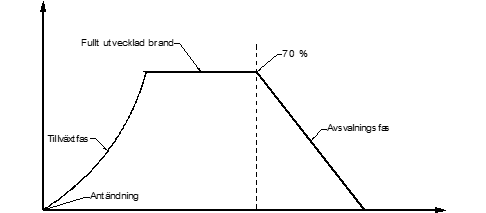
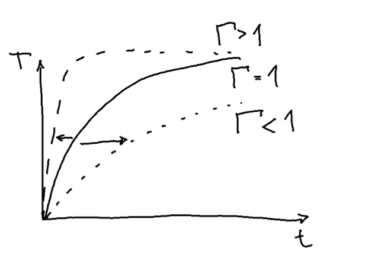
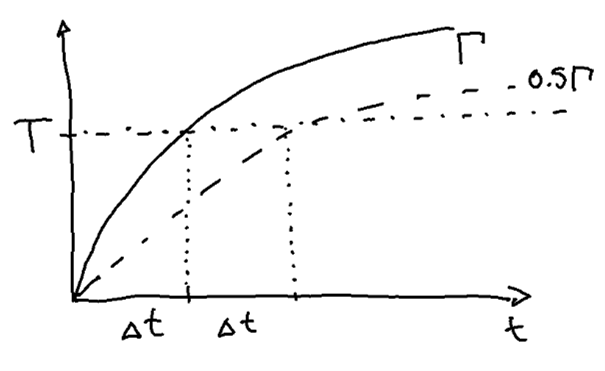

## Dimensionerande brandförlopp

Vid dimensionering av bärande konstruktioner tillämpas generellt nominellt eller naturligt brandförlopp. Dessa kan sedan delas in ytterligare och kvantifieras i form av tid-temperatur¬förlopp. 

Den nominella branden är en teoretisk brand som är framtagen i första hand för provning och som ett jämförelsemått av brandmotstånd. Nominella bränder är mycket användbara som dimensioneringsverktyg då de är enkla att reproducera och där resultaten kan tillämpas i många olika byggnader och verksamheter utan att behöva räknas om eller provas på nytt. Dessa bränder är framtagna för provning och förenklad kravställning då de fungerar mer som måttstock för brandskydd än som en representation av temperaturutvecklingen vid en specifik brand. I några enstaka fall ställs krav på att hänsyn ska tas till avsvalningsfasen men det sker endast i undantagsfall och huvudregeln är att det bara är tillväxtfasen som dimensioneras mot. Nominellt brandförlopp motsvarar i första hand standardbrandkurvan, utvändig brand, kolvätebrand men också tunnelbränder som RWS, Eurekakurvan och liknande.

Naturlig brand är ett samlingsnamn för alla de bränder som tas fram för specifika objekt med syfte att representera de faktiska förhållandena som kan uppstå vid brand. Detta kan utgöras av rumsbrand, lokal brand eller en kombination av dessa beroende på hur branden utvecklar sig. 

Figur [-@fig-brandforlopp] visar en schematisk uppställning av olika designbränder och hur dessa tematiskt hänger ihop.

::: {#fig-brandforlopp}

```{mermaid}
flowchart TD
    A("Dimensionerande brand") --- B("Naturlig brand")
    A --- C("Nominell brand")
    B --- D("Brand som inte går till övertändning")
    B --- E("Brand som går till övertändning")
    D --- F("Lokal brand")
    E --- G("Parametrisk brand")
    E --- H("Avancerad brandmodell")
    C --- I("Standardbrand")
    C --- J("Utvändig, HC, RWS, osv.")
    classDef colorFill fill:#CFE3F5;
    classDef colorDefault fill:white;
    classDef colorText color:black;
    class F,G,H,I colorFill;
    class A,B,C,D,E,J colorDefault;
    class A,B,C,D,E,F,G,H,I,J colorText;
```

Olika designbränder som kan användas vid brandteknisk dimensionering av konstruktioner.
:::

Nedan följer en kortare redogörelse för dimensionering mot de bränder som markeras som blå i figur [-@fig-brandforlopp]. Tabell [-@tbl-firelimit] visar en sammanställning över de olika dimensionerande bränderna och deras giltighet.


::: {#tbl-firelimit tbl-cap="Översikt över olika dimensionerande bränder och när de är tillämpliga."}

<table style="margin-left:auto; margin-right:auto">
  <thead>
    <tr>
      <th style="padding:8px 16px;"></th>
      <th style="padding:8px 16px;">&lt;500 m²</th>
      <th style="padding:8px 16px;">&gt;500 m²</th>
    </tr>
  </thead>
  <tbody>
    <tr>
      <td style="padding:8px 16px;text-align:left">Nominell brand</td>
      <td style="background-color:#8BC34A; text-align:center;">Ja</td>
      <td style="background-color:#8BC34A; text-align:center;">Ja</td>
    </tr>
    <tr>
      <td style="padding:8px 16px;text-align:left">Parametrisk brand</td>
      <td style="background-color:#8BC34A; text-align:center;">Ja</td>
      <td style="background-color:#F44336; text-align:center;">Nej</td>
    </tr>
    <tr>
      <td style="padding:8px 16px;text-align:left">Enbart lokal brand</td>
      <td colspan="2" style="text-align:center;">P(f<sub>o</sub>) = 0*</td>
    </tr>
    <tr>
      <td style="padding:8px 16px; text-align:left">Avancerad brandmodell</td>
      <td style="background-color:#8BC34A; text-align:center;">Ja</td>
      <td style="background-color:#8BC34A; text-align:center;">Ja</td>
    </tr>
  </tbody>
</table>

<p><em>*P(f₀) = sannolikhet för övertändning till följd av brandtekniska åtgärder.</em></p>

:::

Nedan följer en kortare beskrivning av alla bränder och hur de kan tillämpas.

### Nominella bränder
Här redogörs för de två vanligaste nominella bränderna. En nominell brand motsvarar löst en övertänd brand utan avsvalningsfas. Den nominella branden tar ingen hänsyn till omgivande material eller ventilationsförhållanden vilket gör den oflexibel. Bristen på flexibilitet är samtidigt det som gör branden lämplig för jämförelse då alla objektsspecifika egenskaper är neutraliserade. I stället för att vara en representation av den faktiska branden i ett utrymme, bör standardbranden ses som en måttstock för hur bra (eller dåligt) ett element kan förväntas prestera vid brand.

#### Standardbrand {.unnumbered}

Standardbranden är det vanligaste tid-temperaturförloppet vid dimensionering av brandutsatta bärande konstruktioner. De flesta handböcker och standardlösningar är framtagna mot denna. Temperaturutvecklingen beskrivs i en ekvation på formen

$$
T_f=20+345log\left(8t+1\right)
$$

där tiden, $t$, anges i minuter. R-klass definieras mot standardbrandkurvan där R står för bärande funktion med en tidsangivelse i minuter efteråt. R 60 står alltså för hållfasthet i 60 minuter vid exponering av standardbrand.

#### Utvändig brand {.unnumbered}

Då det inte sker termiska återkoppling på samma sätt utomhus som vid rumsbrand så blir temperaturerna inte lika höga. För dessa fall är den utvändiga brandkurvan en lämplig brand att använda. De lägre temperaturerna kan också representeras genom att anta en kortare tid av standardbrandpåverkan, något som tillämpades tidigare med bland annat balkonger i Sverige. Temperaturutvecklingen beskrivs i en ekvation på formen

$$
T_f=20+660\left(1-0.687e^{-0.32t}-0.313e^{-3.8t}\right)
$$

där tiden, $t$, anges i minuter.

### Naturliga bränder

Till skillnad från standardbranden, finns en ambition med naturliga bränder att försöka ge en representation av den faktiska påverkan som kan uppkomma vid brand. Vid naturliga bränder tas hänsyn till temperaturutvecklingen i förhållande till de termiska egenskaperna hos omgivande konstruktion, syretillgång och brandbelastningens storlek. Alla dessa parametrar styr både brandens temperaturutveckling och längd.

Antagande om naturligt brandförlopp är i första hand ett designalternativ i de fall det är uppenbart att standardbrandens tidskrav för en byggnad inte stämmer med de faktiska förhållanden som råder i objektet. Exempel på sådana fall är lokaler där övertänd brand (liknande standardbrand) inte är trolig, verksamheter med mycket låg brandbelastning, eller i de där bedömningen är att kravnivån bör vara högre än den förenklade.

Alla naturliga bränder bygger på att översätta en tänkt effektkurva till en temperatur-dito som sedan kan användas som termisk last på konstruktioner i en hållfasthetsberäkning. Effektkurvan skiljer sig här från den som tillämpas vid utrymningsberäkningar då den inte begränsas av ett fast värde utan av om den är syre- eller bränslekontrollerad. För dimensionering av bärande konstruktioner i Sverige anges att branden ska förutsättas gå till övertändning vilket i sin tur betyda att branden kan bli väldigt stor, i vissa fall över både 100 och 200 MW, se figur [-@fig-fullstandigbrand].

{#fig-fullstandigbrand}

Tillväxtfasen styrs av en referenstid som liknar den för $\alpha t^2$ som tillämpas i en amerikansk kontext men där måleffekten förenklat kan sägas vara 1000 kW istället för 1055 kW som i den amerikanska motsvarigheten. Motsvarigheten till $\alpha$-värdet skrivs som $10^6⁄t_{ref}^2$ där den resulterande effekten anges i W i stället för kW.

$$
\dot Q = \frac{t^2}{t_{ref}^2}10^6
$$

$t_{ref}$ är då tiden det tar för branden att nå en megawatts storlek och är normalt 150, 300 eller 600 sekunder. Dessa tider motsvarar snabb, normal eller långsam brandtillväxt. 

I avancerade modeller antas branden klinga av linjärt när 70 % av brandbelastningen förbränts. Vid översättningen till den parametriska branden går det inte att säga att temperaturen också klingar av när branden börjar klinga av. I stället antas brandtemperaturen börja klinga av först när allt brännbart i rummet är borta. Avsvalningen är heller inte klar samtidigt som allt brännbart är borta utan det finns en viss fördröjning till följd av väggarnas uppvärmning. Tiden tills avsvalningen börjar beräknas utifrån den ekvation som först togs fram av Kawagoe

$$
t_{end}=\frac{E_{tot}}{{\dot Q}_{max}}
$$

där

$$
{\dot Q}_{max}=0.1 m \Delta H_u A_o \sqrt{h_o}
$$

och

$$
E_{tot}=A_t q^{''}_{fl}
$$

I ovanstående är $m$ förbränningsfaktorn, $\Delta H_u$ energiinnehållet i trä, $A_o$ summan av öppningsareorna, $h_o$ öppningarnas viktade höjd, $A_t$ den totala omslutningsarean och $q^{''}_{fl}$ är brandbelastningen per m² omslutningarea.

Genom att ersätta $E_{tot}$ och ${\dot Q}_{max}$ och översätta $t_{max}$ från sekunder till timmar kan tiden till det att avsvalningen påbörjas skrivas som

$$
t_{max}=\frac{1}{3600} \frac{E_{tot}}{{\dot Q}_{max}}=
\frac{1}{3600} \frac{A_t q^{''}_{fl}}{0.1 m \Delta H_u A_o \sqrt{h_o}}=\frac{1}{3600} \frac{q^{''}_{fl}}{0.1 m \Delta H_u \frac{A_o \sqrt{h_o}}{A_t}}
$$

Med den rekommenderade förbränningsfaktorn, $m$ = 0.8 och $\Delta H_u$ = 17.5 MJ/kgK samtidigt som öppningsfaktorn, $O$, kan ersätta det som har med ventilationen att göra enligt

$$
O=\frac{A_o \sqrt{h_o}}{A_t}
$$

kan ekvationen förenklas till

$$
t_{max}=\frac{0.0002 q^{''}_{fl}}{O}
$$

Vilket kan användas för att beräkna tiden till det att avsvalningen påbörjas, $t_{max}$, i timmar.

#### Avancerade brandmodeller {.unnumbered}

Naturlig brand kan beräknas på många sätt. Oavsett vilket brandrum och brand kan en avancerad modell användas. Brandförloppet och temperaturutvecklingen ska beräknas ur värme- och massbalansekvationer vilket är det normala för alla typer av tvåzonsmodeller och CFD-koder. Vid användning av CFD-koder bör försiktighet tillämpas i fråga om övertända bränder då dessa inte är framtagna för att klara den typen av beräkning på ett bra sätt men också då beräkningarna blir väldigt känsliga på grund av att brandens placering spelar stor roll för den resulterande temperatur-påkänningen mot ytor. CFD-koder bör därför bara användas i fall där brandens är väl definierad i rummet eller där direkt påverkan från den lokala branden kan ignoreras.

Det är istället rekommenderat att göra beräkningarna med någon form av en- eller tvåzonsmodell och istället göra många beräkningar för att få en uppfattning om temperaturspann utifrån så många olika parametrar som är görbart. Detta bygger på principen om att ha en genomgående nivå på beräkningar och antaganden. Att vara väldigt noggrann med vissa delar (exempelvis CFD) i kombination med grova antaganden om brandbelastning ger en falsk känsla av att vara exakt rätt trots att beräkningarna lika gärna kan vara helt fel. En genomgående nivå på antaganden och beräkningar ger oftare ett svar som är ungefär rätt och mer sällan helt fel. Grundprincipen är alltid att använda modeller som går att förstå på ett principiellt plan och möjligtvis kontrollera detaljer eller illustrera med mer detaljerade modeller.

Tillämpning av avancerade brandmodeller regleras i EN 1991-1-2 Annex D.

#### Parametrisk brand

Den parametriska branden är en matematisk översättning av de naturliga brandkurvor som togs fram på 70-talet i Lund. Tid-temperaturförloppet från de naturliga brandkurvorna är sedan översatta från ett tidigare uttryck för standardbrandkurvan så som det tillämpades i Sverige före 1980 (Wickström, 1985). Metoden är dock begränsad till små brandrum (<500 m² och max 4 m höjd).

Tid-temperaturförloppet beskrivs alltså i grunden som standardbrandens temperaturtillväxt men med en förskjuten tidsskala. Ekvationen för att beskriva temperaturtillväxten i rummet ges på formen

$$
T_f=T_0+1325\left(1-0.324 e^{-0.2t^*}-0.204 e^{-1.7t^*}-0.472 e^{-19t^*}\right)
$$

Där tiden $t^*$ är den förskjutna tiden, $t$, i timmar multiplicerat med gammafaktorn, $\Gamma$. Förskjutningen sker för att justera brandförloppet i förhållande till väggarnas termiska tröghet och öppningarnas utformning. I ekvationen är tiden angiven i timmar. $T_0$ är temperaturen i brandrummet vid brandstart och brukar antas till 20°C.

Ett värde på $\Gamma$ som är lika med 1 ger därför en temperaturutveckling som i allt väsentligt liknar standardbrandkurvan. Ett större värde på $\Gamma$ ger en snabbare temperaturutveckling och omvänt för ett lägre värde, se figur [-@fig-gamma1].

{#fig-gamma1 width=50%}

Förenklat kan skalningen sägas vara omvänt proportionell mot värdet på $\Gamma$ där halva värdet på $\Gamma$ ger en hälften så snabb uppvärmning. Det tar alltså dubbla tiden att nå samma temperatur, se figur [-@fig-gamma2].

{#fig-gamma2 width=50%}

##### Gammafaktorn, $\Gamma$ {.unnumbered}

$\Gamma$-faktorn bygger på öppningsfaktorn, $O$, och omgivande konstruktions termiska tröghet, $b$ enligt

$$
\Gamma=\frac{\left( O/O_{ref} \right)^2}{\left( b/b_{ref} \right)^2}
$$

Öppningsfaktorn och den termiska trögheten viktas mot ett referensvärde, $O_{ref}$ och $O_{ref}$. För öppningsfaktorn är referensvärdet, $O_{ref}$ = 0.04 m¯¹ och för den termiska trögheten, $b_{ref}$ = 1160 J/m²s$^½$K. För rum med egenskaper som motsvarar $O_{ref}$ och $b_{ref}$ kommer temperaturkurvan motsvara den hos standardbranden. För övriga rum kommer temperaturökningen vara långsammare eller snabbare.

##### Öppningsfaktorn, $O$ {.unnumbered}

Öppningsfaktorn kan ses som ett mått på hur snabb luftomsättningen kan förväntas vara i ett rum. Ett stort värde på O ger stor luftomsättning med följden att branden både kan uppnå större effekt snabbare och kylas av snabbare.

Öppningsfaktorn, $O$, beräknas som

$$
O=\frac{A_o \sqrt{h_o}}{A_t}
$$

Där 

&nbsp;&nbsp; $A_o$ - summan av arean för alla ventilationsöppningar           
&nbsp;&nbsp; $h_o$ - den viktade höjden på öppningarna enligt $h_{o}=A_o/w_o$  
&nbsp;&nbsp; $w_o$ - den totala bredden på alla öppningar                     
&nbsp;&nbsp; $A_t$ - den totala omslutningsarean inklusive öppningar          


En öppningsfaktor på minst 0.02 (m$^½$) bör användas för att ta hänsyn till otätheter och läckage.

##### Den termiska trögheten, $b$ {.unnumbered}

Den termiska trögheten är i stället ett mått på hur mycket energi som kan tas upp av, och lagras av omgivande konstruktioner. En betongvägg kan ta upp mycket energi och ger därför ett högre värde på b medan en lättkonstruktion med gipsskivor och stenullsisolering håller kvar värmen i rummet med ett lågt värde på $b$.

Den termiska trögheten, $b$, beräknas som

$$
b=\sqrt{\lambda \rho c_p}
$$

Där 

&nbsp;&nbsp; $\lambda$ - är värmeledningstalet för omgivande konstruktioner  
&nbsp;&nbsp; $\rho$ - är densiteten för omgivande konstruktioner  
&nbsp;&nbsp; $c_p$ - är den specifika värmen för omgivande konstruktioner

För omgivande konstruktioner med fler material finns beräkningsmetoder presenterade i EN 1991-1-2.

##### Avsvalning {.unnumbered}

Avsvalningen beror till stor del på den termiska trögheten hos omgivande konstruktioner och hur länge dessa värmts upp. För att inte komplicera allt för mycket antogs avsvalningen vara linjär. Detta, då det bedömdes att den temperatur då eventuell inbromsning i avsvalningen kommer vid så låga temperaturer att de i praktiken inte påverkar konstruktionerna och därför mer komplicerar beräkningarna.

Avsvalningen beräknas utifrån den termiska trögheten och hur lång tid konstruktionerna har värmts upp. Temperaturen i avsvalningsfasen beräknas normalt som

$$
T_{f}=\begin{cases}
  T_{max}-625\left(t^*-t^*_{max}x\right) & \text{för  }t^*_{max} \leq 0.5 \\
  T_{max}-250\left(3-t^*_{max}\right)\left(t^*-t^*_{max}x\right) & \text{för  }0.5 < t^*_{max} < 2.0 \\
  T_{max}-250\left(t^*-t^*_{max}x\right) & \text{för  }t^*_{max} \geq 2.0 \\
  \end{cases}
$$

Genom att anta att $T_f$ har återgått till $T_0$  kan tiden till avslutad avsvalning, $t_{cool}$ beräknas. Genom att beräkna $t_{cool}$ kan sedan temperaturen under avsvalningsfasen interpoleras för alla tider mellan $t_{max}$ och $t_{cool}$ genom att anta att temperaturen vid $t_{cool}$ är 20°C.

$$
t_{cool}=\begin{cases}
  \frac{\frac{T_{max}-T_0}{625}+t^*_{max}}{\Gamma} & \text{för  }t^*_{max} \leq 0.5 \\
  \frac{\frac{T_{max}-T_0}{250\left(3-t^*_{max}\right)}+t^*_{max}}{\Gamma} & \text{för  }0.5 < t^*_{max} < 2.0 \\
  \frac{T_{max}-T_0}{250\Gamma}+t_{max} & \text{för  }t^*_{max} \geq 2.0 \\
  \end{cases}
$$

$t_{cool}$ beräknas här i timmar och $T_{max}$ beräknas som brandtemperaturen vid $t_{max}$.

Det finns situationer som avviker från ovanstående. Det är ovanligt förekommande men sker vid låg brandbelastning i kombination med tillräckligt stora ventilationsöppningar. I dessa fall antas övertändningen inte kunna ske och branden begränsas av andra faktorer. Mer om detta i EN 1991-1-2.

#### Lokal brand

Alla bränder är inledningsvis lokala. Dimensionering bör förutsätta att branden går till övertändning och endast begränsas av syre- respektive bränsletillgång. För fall där brandhärden är tydligt begränsad i rummet eller där övertändning inte kan förväntas ske är det dock möjligt att branden stannar som lokal. Normalt kan dock en brand gå till övertändning även i mycket stora lokaler.

För BK2- och BK3-byggnader finns möjligheten att tillämpa lokal brand även i lokaler där brand kan gå till övertändning. Detta förutsätter att sannolikheten för övertändning är tillräckligt liten, exempelvis genom att tekniska system förhindrar branden att växa sig så stor att övertändning kan ske. För BK1-byggnader finns dock inte samma möjlighet. 
Brandpåkänning från lokal brand kan beräknas med metoder angivna i EN 1991-1-2 Annex C.

### Fire severity

I den tidiga brandprovningen klassificerades byggnadsdelar utifrån hur länge de motstod en brand. Branden kvantifierades sedan till att likna den standardbrandkurva som tillämpas idag och ambitionen var att den skulle någorlunda representera en tänkt brandutveckling [Babrauskas]. Under 1920-talet gjordes försök där temperaturen i brandrum mättes över tid beroende på brandbelastning i rummet. Temperaturen översattes till en brandpåverkan som i sin tur översattes till den tid med standardbrand som samma brandpåverkan uppnåtts [Ingberg]. Efter andra världskriget noterades att detta förhållande endast var giltigt för obrännbara konstruktioner då en av förutsättningarna var att stommen i sig inte fick bidra till brandförloppet [PW building studies].

Under den våg på 1990-talet då intresset ökade för funktionsbaserad dimensionering kopplades dessa två principer; standardbrand och naturligt brandförlopp, isär och kravuppfyllnad kunde från och med då uppnås med endera metoden. Frikopplingen av standardbrand som ensam kravställare utan koppling till naturligt brandförlopp öppnade upp för träbyggande i större omfattning än tidigare. Det skapade också nya utmaningar i det att den koppling som varit mellan fullständigt brandförlopp och tid på standardbrandkurvan, tappat delar av sin giltighet.

